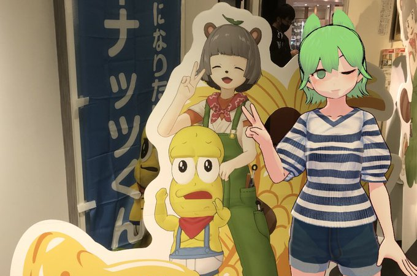

import Twitter from "../../../components/Twitter.astro";

ぽこピー展in名古屋に行きました。

- 

## ツイート

<Twitter url="https://x.com/dokudamichang/status/1587428065701146630" />

<Twitter url="https://x.com/dokudamichang/status/1585536532852903936" />

<Twitter url="https://x.com/dokudamichang/status/1586168963373084672" />

