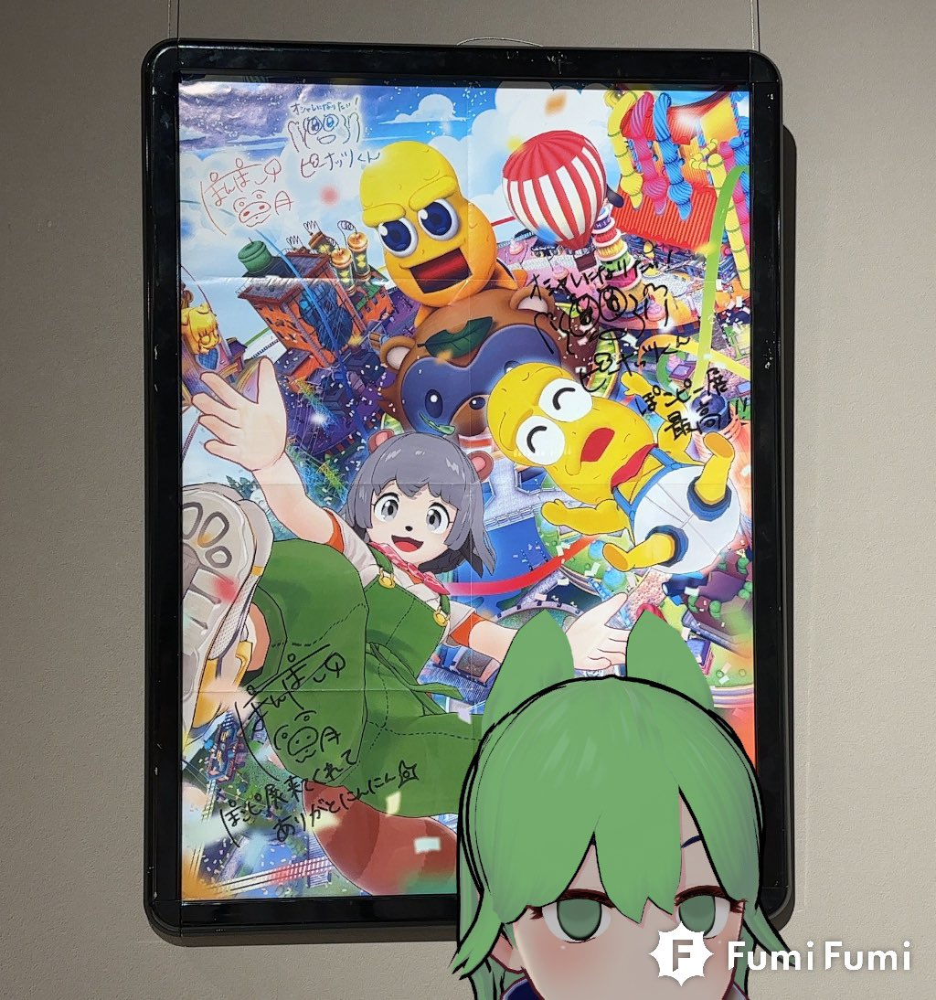

import Twitter from "../../../components/Twitter.astro";

続ぽこピー展FINALin東京に行きました。

- 

## ツイート

<Twitter url="https://x.com/dokudamichang/status/1702314247722877035" />

<Twitter url="https://x.com/dokudamichang/status/1699921731073495212" />

