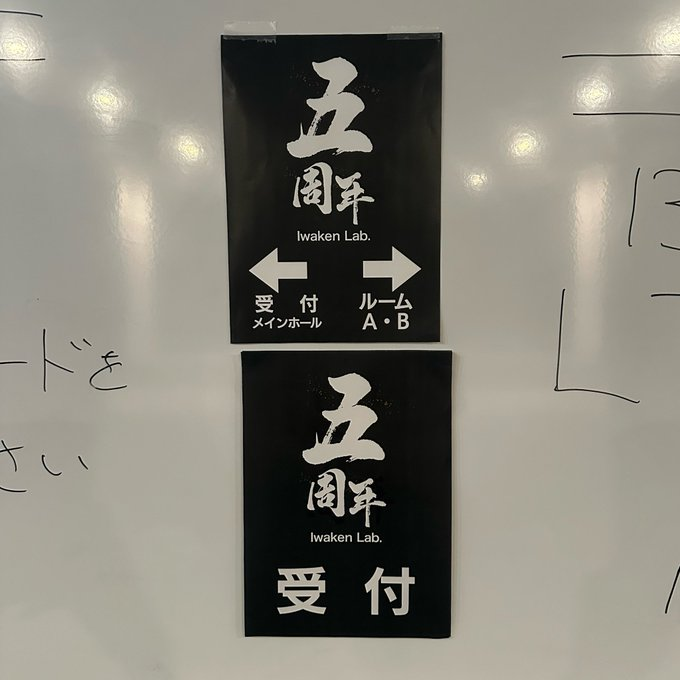

import Twitter from "../../../components/Twitter.astro";

IwakenLab5周年のイベントに行きました。

- 

## ツイート

<Twitter url="https://x.com/dokudamichang/status/2073771548369183153" />

<Twitter url="https://x.com/iwaken71/status/2073809525422129186" />

